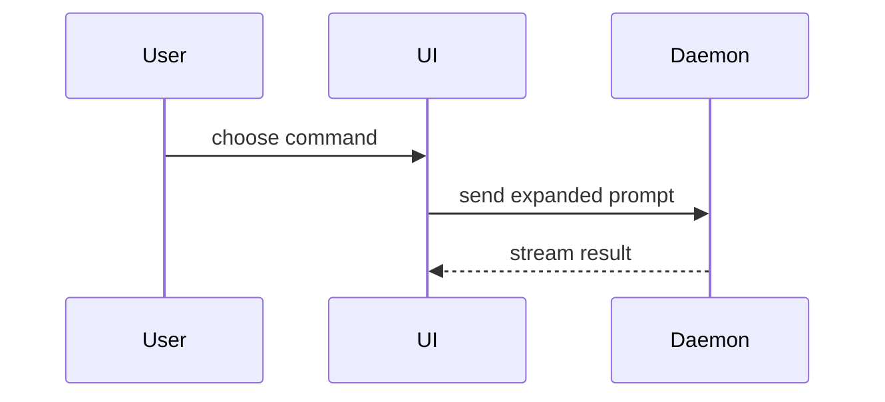

# Write a PR title and description

Use this template for writing the PR body:

```markdown
## Summary

<diagram, diff-sketch, or tree>

## Evidence

- **Before:** <screenshot/output/failing test run>
  **After:** <screenshot/output/passing test run>

## Merge Danger

**Door:** one-way or two-way
**Blast Radius:** <potential ramifications of merge>

Lands decision NN. Follow-up to #NNNN.
```

> **This repo has no issue tracker.** There is no ticket id in the title and no `Closes` line.
> A PR anchors itself to the numbered entry in `docs/09-decisions.md` it lands or sharpens
> (`Lands decision 56.`) and to the PRs it follows from (`Follow-up to #93.`); drop the closing
> line when neither applies. The tracker wording below is kept for reuse in a repo that has one.

## Sections

Skip all preambles and keep prose brief. Use the project's own language: the `SCHEMA` nouns in `src/core/db.client.ts`, the terms `docs/09-decisions.md` fixed, and the role taxonomy in `docs/conventions/naming.md`.

### Summary

Pick the smallest view that makes the key point clear.

- Show logic or an algorithm as pseudocode:

```text
on(save)
  if content is unchanged
    return cached result
  write new content
  return fresh result
```

- Show runtime control flow as a call tree:

```text
submitForm
  createSession
    persistPrompt
    launchAgent
  navigateToSession
```

- Show UI structure as a component tree, including state and module boundaries that matter:

```tsx
<SessionPage> (apps/example/src/routes/session.tsx)
  useSessionEvents()
  <SessionToolbar>
    <RunSkillButton> (packages/ui)
```

- Show file responsibility or a broad refactor as a shallow file tree:

```text
src/
├── commands/       # parses user actions
├── sessions/       # owns session state
└── transport/      # sends API requests
```

- Show component interaction, control flow, or data flow with Mermaid:



- Use `diff` when the point is what changes and the surrounding shape already exists. Match the diff shape to the topic.

For a component change:

```diff
 <SessionPage>
   useSessionEvents()
   <SessionToolbar>
+    <RunSkillButton />
   <SessionTimeline>
+    <SkillResultCard />
```

For a file-layout change:

```diff
 src/
 ├── commands/
+│   └── show-me.ts       # expands the slash command
 ├── sessions/
-└── transport.ts
+└── transport/
+    ├── client.ts
+    └── stream.ts
```

For a call-tree or call-stack change:

```diff
 submitForm
   createSession
     persistPrompt
+    expandSkillMention
     launchAgent
-  navigateToSession
+  navigateToSession
+    subscribeToEvents
```

For a state or control-flow change:

```diff
 on(save)
-  write content
+  if content is unchanged
+    return cached result
+  write new content
+  invalidate cache
```

- Show the whole block when most of it is new, when omitted context would hide ownership or order, or when the user needs a copyable target shape:

```ts
function expandSkill(command: string): string {
  const skillName = command.slice(1);
  return `use the ${skillName} skill`;
}
```

#### Guidance

Place each visual next to the short text it supports. Keep only the calls, files, props, states, and boundaries needed to answer the user's current question or the options to resolve the current discussion point.

You may use one of these, you may use several, it is unlikely you will use all of them. Use your judgement and don't overwhelm the user.

### Evidence

Concrete evidence that the change works. Show a before and after.

Screenshots are S-tier, when the environment is set up for it and the change is visual.

Execution-based evidence is A-tier. Test results, console output. Show the exact test that now fails and passes, using pseudocode.

### Merge Danger

Describe whether it's a one-way or two-way door. You can walk back through two-way doors, but not one-way doors. A PR that is cheap to roll back is lower risk. Changes that involve destructive actions or hard-to-reverse decisions are one-way doors.

The blast radius is the potential impact or scope of the changes introduced by this PR. Consider all possibilities. Examples are layout shift, breakages for consumers, mobile responsiveness, etc.

In this repo the doors worth naming: a `SCHEMA` or `MIGRATIONS` change in `src/core/db.client.ts` reaches every store under `~/.pupitre/` on next open (say whether it is additive and nullable, and what a store created before it does); a gate stage, compiled hook, or profile-compiler change reaches every session launched after it merges, including the conductor's; anything that shells out (`git`, `gh`, `tmux`, `claude -p`) is where the security review looks, so name what a session-controlled worktree could feed it.

## Workflow

1. **Gather context** (run together):

   The trunk is `GIT_TRUNK` from `.claude/project.env` (default `main`); substitute it below.

   ```sh
   git branch --show-current                              # MUST NOT be the trunk; abort if it is
   git log <trunk>..HEAD --pretty=format:'%h %s%n%b'         # commits on this branch
   git diff <trunk>...HEAD --stat                            # changed files + churn
   gh pr view --json number,url,state,title,body 2>/dev/null   # non-zero exit = no PR yet
   ```

   Read the diff for the key files (`git diff <trunk>...HEAD -- <path>`); on large diffs lean on `--stat` plus the important files.

2. **Ground in the decisions log (read-only).** Grep the diff and commit bodies for `decision \d+` and read those entries in `docs/09-decisions.md`; grep `git log <trunk>..HEAD` for `#\d+` to find the PRs this one follows from. A PR that edits the decisions log lands the entry it adds. No decision touched: derive from diff + commits.

3. **Draft title + body together.** Title per [Title format](#title-format); body to a temp file (`mktemp`) per the template and [Sections](#sections), obeying [Body rules](#body-rules). For an existing PR, treat the current title and body as a draft, not a constraint.

4. **Create or update the PR.** Show the drafted **title** and **body** + the exact `gh` command; quick confirm before running (notifies reviewers + CODEOWNERS) unless told to just do it.

   ```sh
   git rev-parse --abbrev-ref --symbolic-full-name @{u} 2>/dev/null || git push -u origin "$(git branch --show-current)"
   # update existing; pass --title only if it changes:
   gh pr edit <number> --body-file <tmp> [--title "<drafted title>"]
   # or create new:
   gh pr create --base <trunk> --title "<drafted title>" --body-file <tmp>
   ```

   Report the PR URL.

## Title format

Communicate *what changed and why* at a glance, specific enough that a reviewer can predict the diff. GitHub auto-appends ` (#NNNN)` on merge; do not write it yourself.

```
<type>(<scope>): <summary> (PROJ-XXXX)
```

- **`<type>`**: dominant intent of the diff.

  | Type       | Use for                                     |
  | :--------- | :------------------------------------------ |
  | `feat`     | New feature or capability                   |
  | `fix`      | Bug fix                                     |
  | `refactor` | Code restructuring with no behaviour change |
  | `docs`     | Documentation only (includes ADRs)          |
  | `test`     | Adding or updating tests                    |
  | `chore`    | Build config, dependencies, tooling         |
  | `perf`     | Performance improvement                     |

  Mixed diff: pick the user-visible win, mention the rest in the Summary.
- **`<scope>`**: optional but usually present. Lowercase kebab, naming the component or area touched. Common scopes in this repo: `gate`, `cli`, `ui`, `conductor`, `watch`, `profile`, `init`, `store`, `adapters`, `claude`, `report`, `tooling`, `skills`, `deps`. Multi-scope `(gate,cli)` only when both are non-trivial. Drop the scope when the change is repo-wide.
- **`<summary>`**: imperative present tense, lowercase first word, no trailing period. Proper nouns keep their case (`Biome`, `SQLite`, `Vitest`, `GitHub`); double quotes around identifiers are fine.
- **`(PROJ-XXXX)`**: a tracker id; there is none here, so drop it. Follow-ups read `(follow-up to #NNNN)`.

**Lint:**

- No em-dash (`—` / `–`). Hyphen, colon, or rephrase.
- No trailing period; no capital after the colon (proper nouns excepted).
- ≲ 80 chars including `(PROJ-XXXX)`; if over, trim adjectives, not specificity.
- Reject generic verbs (`update`, `improve`, `change`, `various`). Strong fix-title names cause, surface, impact: `fix(api): race condition in cache invalidation that caused 502s under load`, not `fix bug`.

**Worked examples:**

| Diff shape                          | Title |
| :---------------------------------- | :---- |
| Gate change landing a decision      | `fix(gate): keep test files and other checkouts out of the coverage report` |
| Targeted store bug                  | `fix(store): resolve the ambiguous "id" in the backlog listing` |
| Decision landing ahead of impl      | `docs: record decision 57 on the post-Bash scope re-check` |
| Follow-up to a prior PR             | `chore(skills): take the template's implement and wayfinder skills (follow-up to #93)` |
| Repo-wide change, no scope          | `feat: drop PUP_SESSION_ID from every tmux client env` |

## Body rules

- **No em-dash** (`—` / `–`). Hyphen or colon.
- **No hardcoded hostnames/URLs.** Derive from config; link tracker issues by id/URL only.
- **Anchor, don't close.** End the body with `Lands decision NN.` when the PR adds or sharpens an entry in `docs/09-decisions.md`, and `Follow-up to #NNNN.` when it continues an earlier PR; GitHub links the `#NNNN`. No `Closes` line: there is no tracker to close anything on.
- **No attribution footer.** Never add `🤖 Generated with Claude Code` (or any agent attribution) to the PR body. The `Co-Authored-By` trailer on commits is the only attribution.

The Summary views are adapted from Dex Horthy's `show-me` skill (humanlayer/skills).
